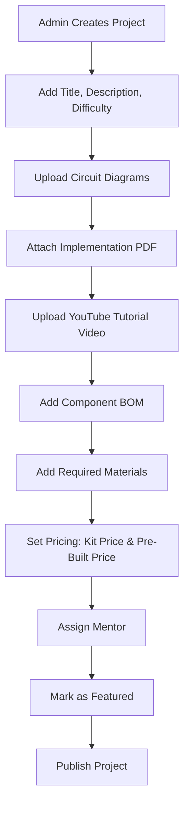
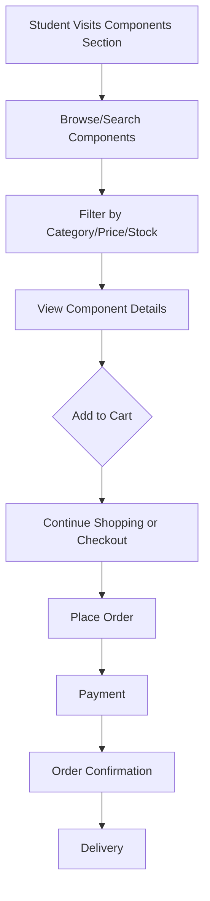
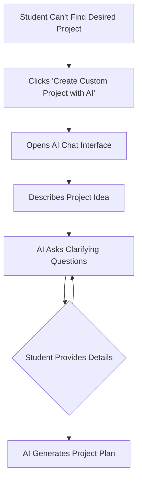

# 🏗️ BuildWise Platform - High-Level Design (HLD)

**Version:** 1.1  
**Last Updated:** December 10, 2025  
**Platform:** BuildWise - Hardware Project Platform for Engineering Students

---

## 📋 Table of Contents

1. [Product Vision](#product-vision)
2. [Core Features Overview](#core-features-overview)
3. [User Roles & Permissions](#user-roles--permissions)
4. [Feature 1: Featured Projects (Admin-Created)](#feature-1-featured-projects-admin-created)
5. [Feature 2: Component Marketplace](#feature-2-component-marketplace)
6. [Feature 3: AI-Powered Custom Projects](#feature-3-ai-powered-custom-projects)
7. [Feature 4: Student Marketplace (2nd-Hand & Pre-Built)](#feature-4-student-marketplace-2nd-hand--pre-built)
8. [Data Models & Relationships](#data-models--relationships)
9. [Access Control Matrix](#access-control-matrix)
10. [Payment & Order Flow](#payment--order-flow)
11. [Mentor System](#mentor-system)
12. [Technical Architecture](#technical-architecture)
13. [API Endpoints Summary](#api-endpoints-summary)
14. [Future Enhancements](#future-enhancements)

---

## 🎯 Product Vision

**BuildWise** is a comprehensive hardware project platform designed for engineering students that combines:

- **Curated Featured Projects** created by admins with professional documentation and video tutorials
- **Component Marketplace** for standalone hardware purchases
- **AI-Powered Project Generation** using Gemini 3 Pro for custom project creation
- **Mentor Support System** for guided project building
- **Student Marketplace** for buying/selling 2nd-hand components and pre-built projects
- **Community Showcase** where students can publish their completed projects

### Core Value Propositions:

1. **For Students:**
   - Access professionally documented hardware projects with video tutorials
   - Purchase components individually or as complete kits
   - Buy pre-built projects assembled by mentors
   - Get AI assistance for custom project ideas
   - Receive mentorship while building projects
   - Sell unused/old components to other students
   - List pre-built projects for sale in student marketplace
   - Showcase completed projects to the community

2. **For Admins:**
   - Create and curate high-quality featured projects
   - Manage component inventory and pricing
   - Review and approve AI-generated custom projects
   - Assign mentors to students
   - Monitor platform analytics

3. **For Mentors:**
   - Guide students through project builds
   - Create documentation and learning materials
   - Conduct sessions and provide support
   - Build teaching portfolio

---

## 🌟 Core Features Overview

### Feature 1: Featured Projects (Admin-Created) 📚
**Status:** Premium Content  
**Creator:** Admin  
**Access Model:** Freemium (view project, pay for docs/PDF)

Admin creates complete, production-ready projects with:
- Full implementation documentation
- Circuit diagrams & schematics (PDF)
- Component BOM (Bill of Materials)
- Required materials list
- Assembly instructions
- YouTube video tutorial
- Mentor assignment for support
- **Option 1:** Buy full kit (DIY)
- **Option 2:** Buy pre-built project (assembled by mentor)

### Feature 2: Component Marketplace 🛒
**Status:** Public  
**Creator:** Admin  
**Access Model:** Direct Purchase

Students can browse and purchase individual components:
- Browse by category, specifications, price
- Add to cart (individual components)
- Direct checkout without project association
- Inventory management with stock tracking

### Feature 3: AI-Powered Custom Projects 🤖
**Status:** Premium Service  
**Creator:** AI (Gemini) + Student + Admin + Mentor  
**Access Model:** Request → Approve → Build → Publish

Student describes project idea → AI generates project plan → Admin reviews → Mentor creates docs + YouTube video → Student builds → Community showcase

### Feature 4: Student Marketplace (2nd-Hand & Pre-Built) 🔄
**Status:** Peer-to-Peer  
**Creator:** Students  
**Access Model:** List → Approve → Buy → Rate

Students can sell:
- Used/unused components (2nd-hand)
- Completed pre-built projects
- Old robotics kits
- Any hardware they no longer need

Student lists item → Admin verifies → Goes live → Other students buy → Seller ships → Rating system

---

## 👥 User Roles & Permissions

### Role Hierarchy:

```
ADMIN (Super User)
├── Create Featured Projects
├── Manage Components & Inventory
├── Approve AI-Generated Projects
├── Assign Mentors
├── Access All Analytics
└── Full System Control

MENTOR (Subject Expert)
├── View Assigned Projects
├── Create Documentation & Materials
├── Conduct Mentorship Sessions
├── Upload Resources (PDFs, diagrams)
└── Communicate with Students

STUDENT (End User)
├── Browse Featured Projects
├── Purchase Components/Kits
├── Request Custom AI Projects
├── Access Purchased Content
├── Build Projects with Mentor Support
└── Publish Completed Projects
```

---

## 📚 Feature 1: Featured Projects (Admin-Created)

### Overview:
Admin creates professional, end-to-end documented projects that serve as premium learning resources.

### User Journey:

#### Phase 1: Admin Creates Featured Project



**Required Data:**
- Project metadata (title, description, difficulty level)
- Circuit diagrams (images/PDF)
- Implementation documentation (PDF - locked)
- **YouTube video tutorial (locked)**
- Component list with quantities
- Material requirements
- Estimated build time
- Learning outcomes
- Prerequisites
- Mentor assignment
- **Pricing options:**
  - **DIY Kit Price:** Components only (student assembles)
  - **Pre-Built Price:** Fully assembled by mentor (premium)

#### Phase 2: Student Discovers Project

**Public Access (Free):**
- ✅ Project title and description
- ✅ Difficulty level and prerequisites
- ✅ Component BOM (list with prices)
- ✅ Required materials list
- ✅ Estimated total cost (DIY Kit & Pre-Built)
- ✅ Project images/screenshots
- ✅ YouTube video preview (first 2 minutes or thumbnail)
- ✅ Learning outcomes
- ✅ Stock availability
- ❌ Full documentation (LOCKED 🔒)
- ❌ Implementation PDF (LOCKED 🔒)
- ❌ Circuit diagram files (LOCKED 🔒)
- ❌ Complete YouTube video tutorial (LOCKED 🔒)
- ❌ Mentor contact (LOCKED 🔒)

**Call-to-Action:**
```
"Option 1: Buy DIY Kit (₹2,499) - Build it yourself with guidance"
"Option 2: Buy Pre-Built (₹3,999) - Fully assembled by admin team"
"Option 3: Buy Individual Components (starting ₹149)"
```

#### Phase 3: Purchase & Unlock

**Option A: Buy DIY Kit (Full Kit)**
- ✅ All components delivered (unassembled)
- ✅ Full documentation unlocked
- ✅ PDF downloads available
- ✅ Complete YouTube tutorial access
- ✅ Circuit diagram access
- ✅ Mentor support enabled (Q&A, troubleshooting)
- ✅ Priority support
- 💰 Price: ₹2,499

**Option B: Buy Pre-Built Project (Assembled by Admin Team)**
- ✅ **Admin builds and tests the project before listing**
- ✅ Listed on website as "Pre-Built - Ready to Ship"
- ✅ Limited inventory (admin builds in batches)
- ✅ Fully assembled and tested project delivered
- ✅ Full documentation unlocked (for understanding/modifications)
- ✅ PDF downloads available
- ✅ Complete YouTube tutorial access
- ✅ Circuit diagram access
- ✅ Extended mentor support (customization guidance)
- ✅ Quality guarantee & warranty (30 days)
- ✅ Already tested, calibrated, and quality-checked
- ✅ Professional packaging
- 💰 Price: ₹3,999 (includes assembly fee + QA + premium components)

**How Pre-Built Works:**
```
1. Admin creates featured project (documentation + video)
2. Admin builds 5-10 units of the project
3. Tests each unit thoroughly
4. Lists on website: "Smart Home System (Pre-Built) - 8 units available"
5. Student purchases from available inventory
6. Admin ships immediately (same/next day)
7. No build time delay
8. Student receives working project
```

**Option C: Buy Individual Components**
- ✅ Selected components delivered
- ✅ Full documentation unlocked (if ALL required components purchased)
- ✅ PDF downloads available
- ✅ YouTube tutorial access (if complete kit bought)
- ✅ Circuit diagram access
- ⚠️ Mentor support (₹500 extra)
- 💰 Price: Variable (₹149+ per component)

**Option D: View Only (No Purchase)**
- ❌ No documentation access
- ❌ No mentor support
- ❌ No video tutorial access
- ✅ Can still purchase individual components from marketplace

#### Phase 4: Build & Publish

```
Student receives order → Access unlocked → Builds with mentor → 
Completes project → Publishes to community → Gets featured
```

**Post-Build:**
- Student can publish their build process
- Add their own images/videos
- Share customizations
- Get community recognition
- Project tagged: "Built by [Student Name]"

---

## 🛒 Feature 2: Component Marketplace (Full E-commerce)

### Overview:
**A complete online e-commerce marketplace** for electronic components, completely independent of projects. Students can browse, search, filter, add to cart, and purchase components like any modern e-commerce platform (similar to Amazon/Flipkart experience).

### User Journey:



### Key Features:

**Full E-commerce Product Page:**
- High-quality product images (multiple angles)
- Component name, SKU, brand
- Detailed technical specifications
- Unit price with any discounts
- Stock availability (In Stock / Low Stock / Out of Stock)
- Customer reviews and ratings
- Related components (recommendations)
- "Frequently bought together" suggestions
- Used in projects (cross-reference)
- Product videos/demos (optional)
- Datasheet downloads

**Advanced Filtering & Search:**
- Smart search with autocomplete
- Category hierarchy (Microcontrollers, Sensors, Actuators, etc.)
- Price range slider
- Availability filter
- Brand filter
- Specifications filters (voltage, current, interface type, etc.)
- Sort by: Price, Popularity, New Arrivals, Rating
- Clear all filters option

**Shopping Cart & Checkout:**
- Add/remove items with smooth animations
- Quantity selection (validate against stock)
- Real-time price calculation
- Discount codes / Promo codes
- Multiple payment options
- Save cart for later
- Guest checkout or login
- Estimated delivery date
- Shipping address management
- Multiple addresses support
- Order summary before payment

**User Account Features:**
- Order history
- Track shipments
- Wishlist / Save for later
- Recently viewed items
- Saved addresses
- Payment methods management
- Review & rate purchased items

**Additional E-commerce Features:**
- Product recommendations
- "Customers also bought" suggestions
- Deal of the day / Flash sales
- Bundle offers
- Bulk purchase discounts
- Stock notifications (email when back in stock)
- Compare products
- Product Q&A section

**No Project Association:**
- Students can buy components for their own projects
- No documentation unlock (unless tied to featured project)
- Pure e-commerce experience
- Regular pricing (no kit discounts unless bundled)

### Stock Management:

```typescript
Component {
  stockQuantity: number
  lowStockThreshold: number
  isActive: boolean
}

// Real-time stock updates
- Reserve stock on cart addition (10 min hold)
- Deduct stock on successful payment
- Release stock on cart abandonment
- Admin alerts on low stock
```

---

## 🤖 Feature 3: AI-Powered Custom Projects

### Overview:
Students describe their project ideas, AI generates complete project plans, admin approves, mentor creates materials, student builds and publishes.

### Complete User Journey:

#### Phase 1: Student Initiates AI Chat



**AI Chat Flow:**

```
Student: "I want to build a smart irrigation system using IoT"

AI (Gemini 3 Pro): "Great idea! Let me help you design this project. 
I need some details:

1. What sensors do you want to use? (soil moisture, temperature, humidity)
2. How many plants/zones do you need to water?
3. What's your budget range?
4. Do you want mobile app control or web dashboard?
5. Experience level: beginner, intermediate, or advanced?
6. Any specific microcontroller preference? (Arduino, ESP32, Raspberry Pi)"

[Student provides answers]

AI: "Perfect! I'm generating a complete project plan for you..."
```

#### Phase 2: AI Generates Project Plan

**System Prompt for Gemini 3 Pro:**

```
You are a hardware project design assistant for BuildWise, a platform helping 
engineering students build electronics projects.

CONTEXT:
- Available components database: {componentsList}
- Stock availability: {stockStatus}
- Pricing information: {pricingData}

TASK:
Generate a complete hardware project plan based on the student's requirements.

OUTPUT FORMAT (JSON):
{
  "projectTitle": "Smart IoT Irrigation System",
  "description": "Detailed project description...",
  "difficultyLevel": "INTERMEDIATE",
  "estimatedBuildTime": "2-3 weeks",
  "learningOutcomes": ["IoT basics", "Sensor interfacing", "Mobile app"],
  "components": [
    {
      "componentId": "cm4xxx...",
      "name": "ESP32 Development Board",
      "sku": "ESP32-DEVKIT",
      "quantity": 1,
      "unitPrice": 599,
      "isAvailable": true,
      "inStock": true
    },
    {
      "componentId": "cm4yyy...",
      "name": "Soil Moisture Sensor",
      "sku": "SMS-001",
      "quantity": 3,
      "unitPrice": 149,
      "isAvailable": true,
      "inStock": true
    }
    // ... more components
  ],
  "totalCost": 2499,
  "allComponentsAvailable": true,
  "unavailableComponents": [],
  "alternativeSuggestions": [],
  "projectSteps": [
    "1. Set up ESP32 development environment",
    "2. Connect and test soil moisture sensors",
    // ... more steps
  ],
  "requiredMaterials": [
    "Breadboard",
    "Jumper wires",
    "9V power adapter"
  ],
  "prerequisites": [
    "Basic Arduino/ESP32 programming",
    "Understanding of sensors",
    "WiFi networking basics"
  ],
  "circuitDescription": "High-level circuit explanation...",
  "codeSnippet": "// Basic implementation outline...",
  "estimatedSkillLevel": "INTERMEDIATE"
}

REQUIREMENTS:
1. ONLY use components from the available database
2. Check stock availability - flag if components unavailable
3. Suggest alternatives for out-of-stock items
4. Calculate accurate total cost
5. Provide realistic build time estimate
6. Match difficulty to student's experience level
7. Include all necessary passive components
8. Consider power requirements
9. Ensure complete BOM (no missing parts)
10. Validate technical feasibility
```

**AI Output Example:**

```json
{
  "projectTitle": "Smart IoT Irrigation System with Weather Integration",
  "description": "An automated irrigation system that monitors soil moisture across 3 zones, checks weather forecasts, and waters plants intelligently. Features mobile app control, real-time monitoring, and water usage analytics.",
  "difficultyLevel": "INTERMEDIATE",
  "estimatedBuildTime": "2-3 weeks",
  "totalCost": 2499,
  "allComponentsAvailable": true,
  "components": [
    {
      "componentId": "cm4xxx...",
      "name": "ESP32 Development Board",
      "quantity": 1,
      "unitPrice": 599,
      "inStock": true
    },
    {
      "componentId": "cm4yyy...",
      "name": "Soil Moisture Sensor",
      "quantity": 3,
      "unitPrice": 149,
      "inStock": true
    },
    {
      "componentId": "cm4zzz...",
      "name": "5V Relay Module (4 Channel)",
      "quantity": 1,
      "unitPrice": 299,
      "inStock": true
    },
    {
      "componentId": "cm4aaa...",
      "name": "12V Water Pump",
      "quantity": 3,
      "unitPrice": 349,
      "inStock": true
    }
  ],
  "requiredMaterials": [
    "Breadboard",
    "Jumper wires (M-M, M-F)",
    "12V 2A power adapter",
    "Water tubes and connectors"
  ],
  "learningOutcomes": [
    "ESP32 WiFi programming",
    "Sensor data collection and processing",
    "Mobile app integration (Blynk/Firebase)",
    "Relay control and safety",
    "API integration (weather data)"
  ]
}
```

#### Phase 3: Student Reviews & Submits

**Student Dashboard Shows:**

```
┌─────────────────────────────────────────────────────────┐
│  AI-Generated Project: Smart IoT Irrigation System      │
├─────────────────────────────────────────────────────────┤
│  Difficulty: INTERMEDIATE                                │
│  Build Time: 2-3 weeks                                   │
│  Total Cost: ₹2,499                                      │
│                                                           │
│  Components Required: (7 items)                          │
│  ✅ All components in stock                              │
│                                                           │
│  [View Full Component List]                              │
│  [View Project Overview]                                 │
│                                                           │
│  ⚠️ This is an AI-generated estimate. Our team will     │
│     review and refine this project plan.                 │
│                                                           │
│  [✨ Submit for Admin Review] [🔄 Regenerate]           │
└─────────────────────────────────────────────────────────┘
```

**Actions:**
- ✅ Student reviews AI plan
- ✅ Checks component list and pricing
- ✅ Reads project description
- 🔄 Can regenerate with modified requirements
- ✅ Submits "I want to build this project"

**Database Entry:**

```typescript
AIGeneration {
  id: "cm4xxx..."
  userId: "student_id"
  prompt: "Smart irrigation system with IoT..."
  geminiResponse: { /* full JSON response */ }
  status: "DRAFT"  // DRAFT → ACCEPTED → DISCARDED
  projectId: null  // Will be set when approved
  createdAt: timestamp
}
```

#### Phase 4: Admin Reviews Request

**Admin Dashboard:**

```
┌─────────────────────────────────────────────────────────┐
│  🤖 AI Project Requests (Pending Review)                 │
├─────────────────────────────────────────────────────────┤
│                                                           │
│  Request #127                                            │
│  Student: Sushil Sahani (kingofmonster7@gmail.com)      │
│  College: BVCOE                                          │
│  Submitted: 2 hours ago                                  │
│                                                           │
│  Project: Smart IoT Irrigation System                    │
│  Difficulty: INTERMEDIATE                                │
│  Estimated Cost: ₹2,499                                  │
│  Components: 7 items (all in stock ✅)                   │
│                                                           │
│  [View AI-Generated Plan]                                │
│  [View Student Profile]                                  │
│  [Check Component Availability]                          │
│                                                           │
│  Admin Notes:                                            │
│  ┌─────────────────────────────────────────────────┐   │
│  │ [Add internal notes...]                          │   │
│  └─────────────────────────────────────────────────┘   │
│                                                           │
│  [✅ Approve & Assign Mentor] [❌ Reject] [📝 Request Changes] │
└─────────────────────────────────────────────────────────┘
```

**Admin Actions:**

1. **Review Checklist:**
   - ✅ Verify component availability
   - ✅ Check technical feasibility
   - ✅ Validate pricing accuracy
   - ✅ Assess difficulty level match
   - ✅ Ensure completeness (no missing components)
   - ✅ Check safety considerations
   - ✅ Verify project aligns with platform goals

2. **Decision Options:**
   - **Approve:** Move to mentor assignment
   - **Reject:** Send rejection reason to student
   - **Request Changes:** Ask for clarification/modifications

3. **Approve & Assign Mentor:**

```
┌─────────────────────────────────────────────────────────┐
│  Select Mentor for: Smart IoT Irrigation System         │
├─────────────────────────────────────────────────────────┤
│                                                           │
│  ○ Dr. Rajesh Kumar                                      │
│     Specialization: IoT, Embedded Systems                │
│     Active Projects: 3                                   │
│     Rating: 4.8/5 ⭐                                     │
│     Availability: Available                              │
│                                                           │
│  ● Prof. Anjali Sharma  [SELECTED]                       │
│     Specialization: IoT, Sensors, ESP32                  │
│     Active Projects: 2                                   │
│     Rating: 4.9/5 ⭐                                     │
│     Availability: Available                              │
│                                                           │
│  ○ Mr. Vikas Patel                                       │
│     Specialization: Automation, Arduino                  │
│     Active Projects: 5                                   │
│     Rating: 4.6/5 ⭐                                     │
│     Availability: Busy (next week)                       │
│                                                           │
│  [Confirm Mentor Assignment]                             │
└─────────────────────────────────────────────────────────┘
```

**Database Updates:**

```typescript
// Create actual Project from AI generation
Project {
  id: "cm4proj..."
  title: "Smart IoT Irrigation System"
  description: from AI response
  difficulty: "INTERMEDIATE"
  isFeatured: false
  isAIGenerated: true
  createdById: student_id
  status: "APPROVED"  // New field
  aiGenerationId: "cm4xxx..."  // Link back to AI request
}

// Link components
ProjectComponent {
  projectId: "cm4proj..."
  componentId: "cm4xxx..."
  quantity: 1
}

// Assign mentor
ProjectMentor {
  projectId: "cm4proj..."
  mentorId: "mentor_anjali"
  role: "PRIMARY"
  assignedAt: timestamp
}

// Update AI generation
AIGeneration {
  status: "ACCEPTED"
  projectId: "cm4proj..."
}
```

#### Phase 5: Mentor Creates Documentation

**Mentor Dashboard:**

```
┌─────────────────────────────────────────────────────────┐
│  📝 Your Assigned Project                                │
├─────────────────────────────────────────────────────────┤
│                                                           │
│  Smart IoT Irrigation System                             │
│  Student: Sushil Sahani                                  │
│  Status: Awaiting Documentation                          │
│                                                           │
│  Tasks:                                                  │
│  ☐ Create implementation documentation                   │
│  ☐ Draw circuit diagrams                                │
│  ☐ Write step-by-step guide                             │
│  ☐ Create assembly PDF                                   │
│  ☐ Add troubleshooting section                          │
│  ☐ Record YouTube video walkthrough (REQUIRED)          │
│                                                           │
│  [Start Creating Documentation]                          │
└─────────────────────────────────────────────────────────┘
```

**Mentor Creates:**

1. **Implementation Documentation** (Markdown/PDF)
   - Project overview
   - Circuit diagram with explanations
   - Step-by-step assembly instructions
   - Code walkthrough
   - Testing procedures
   - Troubleshooting guide
   - Safety precautions

2. **Circuit Diagrams** (Images/PDF)
   - Schematic diagram
   - Breadboard layout
   - PCB design (if applicable)
   - Component placement guide

3. **Assembly PDF** (Professional Document)
   - Cover page with project image
   - Introduction
   - Component checklist
   - Assembly steps with photos
   - Code implementation
   - Testing and calibration
   - FAQs

4. **YouTube Video Tutorial** (REQUIRED - New!)
   - Complete build walkthrough (15-30 minutes)
   - Component explanation and identification
   - Step-by-step assembly demonstration
   - Live coding and explanation
   - Testing and troubleshooting tips
   - Tips and best practices
   - Upload to YouTube (unlisted or public)
   - **Format:** 1080p minimum, clear audio, on-screen annotations
   - **Mentor records themselves building the project from scratch**

5. **Code Files** (ZIP)
   - Complete source code
   - Libraries needed
   - Configuration files
   - README with setup instructions

**Upload Interface:**

```
┌─────────────────────────────────────────────────────────┐
│  📤 Upload Project Assets                                │
├─────────────────────────────────────────────────────────┤
│                                                           │
│  Implementation Documentation:                           │
│  [📄 implementation_guide.pdf] [✅ Uploaded]            │
│                                                           │
│  Circuit Diagrams:                                       │
│  [📄 schematic.png] [✅ Uploaded]                       │
│  [📄 breadboard_layout.png] [✅ Uploaded]               │
│                                                           │
│  Assembly Guide:                                         │
│  [📄 assembly_guide.pdf] [✅ Uploaded]                  │
│                                                           │
│  YouTube Video Tutorial: (REQUIRED)                      │
│  [🎥 YouTube URL] [https://youtu.be/xyz123] [✅ Added]  │
│                                                           │
│  Source Code:                                            │
│  [📦 irrigation_system_code.zip] [✅ Uploaded]          │
│                                                           │
│  [Submit for Admin Approval]                             │
└─────────────────────────────────────────────────────────┘
```

**Database Updates:**

```typescript
ProjectAsset {
  id: "cm4asset1"
  projectId: "cm4proj..."
  type: "CIRCUIT_DIAGRAM"
  name: "Schematic Diagram"
  fileUrl: "azure_blob_url/schematic.png"
  isLocked: true  // Requires purchase to access
  uploadedByMentorId: "mentor_anjali"
}

ProjectAsset {
  id: "cm4asset2"
  projectId: "cm4proj..."
  type: "PDF"
  name: "Implementation Guide"
  fileUrl: "azure_blob_url/implementation.pdf"
  isLocked: true
  uploadedByMentorId: "mentor_anjali"
}

ProjectAsset {
  id: "cm4asset3"
  projectId: "cm4proj..."
  type: "VIDEO"  // NEW TYPE
  name: "Complete Build Tutorial"
  fileUrl: "https://youtu.be/xyz123"  // YouTube URL
  isLocked: true  // Requires purchase to access
  uploadedByMentorId: "mentor_anjali"
  duration: 1820  // seconds (30 min 20 sec)
}
```

#### Phase 6: Admin Final Approval

**Admin Review:**

```
┌─────────────────────────────────────────────────────────┐
│  ✅ Final Review: Smart IoT Irrigation System            │
├─────────────────────────────────────────────────────────┤
│                                                           │
│  Student: Sushil Sahani                                  │
│  Mentor: Prof. Anjali Sharma                             │
│  Status: Documentation Complete                          │
│                                                           │
│  Uploaded Assets:                                        │
│  ✅ Implementation Guide (PDF, 2.3 MB)                   │
│  ✅ Circuit Schematic (PNG, 456 KB)                      │
│  ✅ Breadboard Layout (PNG, 523 KB)                      │
│  ✅ Assembly Guide (PDF, 1.8 MB)                         │
│  ✅ Source Code (ZIP, 145 KB)                            │
│                                                           │
│  Quality Checklist:                                      │
│  ✅ All documentation complete                           │
│  ✅ Circuit diagrams clear and accurate                  │
│  ✅ Code tested and working                              │
│  ✅ Safety guidelines included                           │
│  ✅ Professional formatting                              │
│                                                           │
│  [Preview Documentation] [Download Assets]               │
│                                                           │
│  [✅ Approve & Notify Student] [📝 Request Revisions]   │
└─────────────────────────────────────────────────────────┘
```

**Approval Actions:**
- ✅ Admin approves final documentation
- 📧 Student notified via email
- 🔓 Project becomes purchasable
- 📱 Student can now buy components

#### Phase 7: Student Purchases Components

**Student Notification:**

```
📧 Email: Your Custom Project is Ready!

Hi Sushil,

Great news! Your custom project "Smart IoT Irrigation System" has been 
approved and is now ready to build.

✅ Complete documentation prepared by Prof. Anjali Sharma
✅ Circuit diagrams and assembly guide ready
✅ All components are in stock

Total Cost: ₹2,499

[Buy All Components] [View Project Details]

Once purchased, you'll get:
- Full implementation documentation
- Circuit diagrams (downloadable)
- Assembly guide PDF
- Source code with setup instructions
- Direct mentorship support from Prof. Anjali Sharma

Happy Building!
Team BuildWise
```

**Purchase Options:**

```
┌─────────────────────────────────────────────────────────┐
│  💳 Purchase Your Custom Project                         │
├─────────────────────────────────────────────────────────┤
│                                                           │
│  Smart IoT Irrigation System                             │
│                                                           │
│  Option 1: Complete Kit [RECOMMENDED] 🎁                 │
│  ├─ All 7 components                                     │
│  ├─ Full documentation access                            │
│  ├─ Mentor support (included)                            │
│  ├─ Priority shipping                                    │
│  └─ Price: ₹2,499 ✨                                     │
│     [Buy Complete Kit]                                   │
│                                                           │
│  Option 2: Select Components                             │
│  ├─ Choose specific components                           │
│  ├─ Documentation access (if all required bought)        │
│  ├─ Mentor support (₹500 extra)                          │
│  └─ Price: Starting ₹149/item                            │
│     [Select Components]                                  │
│                                                           │
│  Unlock After Purchase:                                  │
│  🔓 Implementation Guide PDF                             │
│  🔓 Circuit Diagrams (downloadable)                      │
│  🔓 Assembly Instructions                                │
│  🔓 Source Code Package                                  │
│  🔓 Mentor Contact & Support                             │
│                                                           │
└─────────────────────────────────────────────────────────┘
```

**Access Control Logic:**

```typescript
// Check if student has purchased project
async function hasProjectAccess(userId: string, projectId: string): Promise<boolean> {
  // Find order with this project's components
  const order = await prisma.order.findFirst({
    where: {
      userId: userId,
      status: 'DELIVERED',  // Only completed orders
      orderItems: {
        some: {
          projectId: projectId
        }
      }
    },
    include: {
      orderItems: {
        where: { projectId: projectId }
      }
    }
  });

  if (!order) return false;

  // Check if ALL required components were purchased
  const projectComponents = await prisma.projectComponent.findMany({
    where: { projectId: projectId }
  });

  const purchasedComponentIds = order.orderItems.map(item => item.componentId);
  const requiredComponentIds = projectComponents.map(pc => pc.componentId);

  // Must have purchased ALL required components
  const hasAllComponents = requiredComponentIds.every(
    reqId => purchasedComponentIds.includes(reqId)
  );

  return hasAllComponents;
}
```

#### Phase 8: Student Builds with Mentor Support

**Student Dashboard After Purchase:**

```
┌─────────────────────────────────────────────────────────┐
│  🔨 Your Project: Smart IoT Irrigation System            │
├─────────────────────────────────────────────────────────┤
│                                                           │
│  Status: Building 🚧                                     │
│  Progress: 40% complete                                  │
│                                                           │
│  📚 Documentation (Unlocked)                             │
│  ├─ [📄 Implementation Guide.pdf]                       │
│  ├─ [📄 Circuit Schematic.png]                          │
│  ├─ [📄 Assembly Guide.pdf]                             │
│  └─ [📦 Source Code.zip]                                │
│                                                           │
│  👨‍🏫 Your Mentor: Prof. Anjali Sharma                    │
│  ├─ Next Session: Tomorrow, 3:00 PM                      │
│  ├─ [📞 Schedule Session]                                │
│  ├─ [💬 Chat with Mentor]                                │
│  └─ [📧 Send Question]                                   │
│                                                           │
│  🛠️ Build Checklist                                     │
│  ☑ Unbox and verify components                          │
│  ☑ Set up ESP32 dev environment                         │
│  ☐ Assemble circuit on breadboard                       │
│  ☐ Test soil moisture sensors                           │
│  ☐ Upload and test code                                 │
│  ☐ Final testing and calibration                        │
│                                                           │
│  [Mark Project Complete] [Need Help?]                    │
└─────────────────────────────────────────────────────────┘
```

**Mentor Support Features:**

```typescript
MentorSession {
  id: "cm4session..."
  projectId: "cm4proj..."
  mentorId: "mentor_anjali"
  userId: "student_id"
  scheduledAt: timestamp
  duration: 60  // minutes
  status: "SCHEDULED"
  meetingLink: "zoom_or_gmeet_link"
  notes: "Focus on sensor calibration"
}
```

#### Phase 9: Completion & Public Publishing

**Student Marks Complete:**

```
┌─────────────────────────────────────────────────────────┐
│  🎉 Congratulations! Project Complete!                   │
├─────────────────────────────────────────────────────────┤
│                                                           │
│  Smart IoT Irrigation System - ✅ Built Successfully!    │
│                                                           │
│  Share your achievement with the community!              │
│                                                           │
│  Upload Your Build:                                      │
│  ┌─────────────────────────────────────────────────┐   │
│  │ [📸 Upload Project Photos]                       │   │
│  │ [🎥 Upload Build Video] (optional)               │   │
│  │                                                    │   │
│  │ Add Description:                                   │   │
│  │ ┌───────────────────────────────────────────┐   │   │
│  │ │ Share your experience building this...     │   │   │
│  │ └───────────────────────────────────────────┘   │   │
│  │                                                    │   │
│  │ What you learned:                                │   │
│  │ ☑ IoT communication protocols                    │   │
│  │ ☑ Sensor integration and calibration            │   │
│  │ ☑ Mobile app development                        │   │
│  │                                                    │   │
│  │ Challenges faced:                                │   │
│  │ ┌───────────────────────────────────────────┐   │   │
│  │ │ Initial sensor calibration was tricky...   │   │   │
│  │ └───────────────────────────────────────────┘   │   │
│  │                                                    │   │
│  │ Customizations made:                             │   │
│  │ ┌───────────────────────────────────────────┐   │   │
│  │ │ Added weather API integration...           │   │   │
│  │ └───────────────────────────────────────────┘   │   │
│  └─────────────────────────────────────────────────┘   │
│                                                           │
│  [🌍 Publish to Community] [Save as Draft]              │
└─────────────────────────────────────────────────────────┘
```

**Public Project Showcase:**

```
┌─────────────────────────────────────────────────────────┐
│  🌟 Featured in Community                                │
├─────────────────────────────────────────────────────────┤
│                                                           │
│  [Project Image - Student's Build]                       │
│                                                           │
│  Smart IoT Irrigation System                             │
│  Built by Sushil Sahani 👨‍💻                             │
│  BVCOE, New Delhi                                        │
│                                                           │
│  ⭐⭐⭐⭐⭐ Difficulty: INTERMEDIATE                      │
│  💰 Total Cost: ₹2,499                                   │
│  ⏱️ Build Time: 2 weeks                                  │
│                                                           │
│  🏆 Achievement Badge: "AI-Powered Custom Build"         │
│                                                           │
│  📝 Student's Review:                                    │
│  "Amazing experience! The AI generated plan was spot-on. │
│   Prof. Anjali's mentorship made the complex parts easy. │
│   Highly recommend for anyone interested in IoT!"        │
│                                                           │
│  💬 23 Comments | 👍 145 Likes | 🔖 89 Saved             │
│                                                           │
│  [View Full Details] [Build This Too!]                   │
└─────────────────────────────────────────────────────────┘
```

**Database Updates:**

```typescript
Project {
  isPublished: true
  publishedAt: timestamp
  studentReview: "Amazing experience..."
  studentImages: ["url1", "url2", "url3"]
  studentVideoUrl: "youtube_or_vimeo_url"
  completedBuilds: 1  // Increments when others build too
  communityRating: 4.8
  likes: 145
  saves: 89
}

// Badge/Achievement
UserAchievement {
  userId: "student_id"
  badge: "AI_POWERED_BUILDER"
  projectId: "cm4proj..."
  awardedAt: timestamp
}
```

---

## � Feature 4: Student Marketplace (2nd-Hand & Pre-Built)

### Overview:
A peer-to-peer marketplace where students can sell used components, completed projects, or any hardware they no longer need. This creates a circular economy within the platform and makes hardware more accessible.

### What Students Can Sell:

1. **2nd-Hand Components**
   - Unused components from previous projects
   - Old/outdated hardware they no longer need
   - Extra components bought by mistake
   - Working components from disassembled projects

2. **Pre-Built Projects**
   - Completed BuildWise projects (from featured or AI-generated)
   - Personal robotics projects
   - College project submissions (after grading)
   - Prototype builds

3. **Complete Kits**
   - Unused project kits
   - Partial kits (clearly marked)
   - Educational robot kits
   - Development boards with accessories

### Complete User Journey:

#### Phase 1: Student Lists Item for Sale

**Listing Interface:**

```
┌─────────────────────────────────────────────────────────┐
│  📦 List Item for Sale                                   │
├─────────────────────────────────────────────────────────┤
│                                                           │
│  Item Type:                                              │
│  ○ 2nd-Hand Component                                    │
│  ● Pre-Built Project                                     │
│  ○ Complete Kit                                          │
│                                                           │
│  Item Details:                                           │
│  Title: [Smart Home Automation System - Fully Built]     │
│                                                           │
│  Description:                                            │
│  ┌─────────────────────────────────────────────────┐   │
│  │ Completed BuildWise featured project.            │   │
│  │ Fully working, tested, and calibrated.           │   │
│  │ Includes all components, documentation.          │   │
│  │ Used for college project (got A+ grade!)         │   │
│  │ Selling because I need space for new projects.   │   │
│  └─────────────────────────────────────────────────┘   │
│                                                           │
│  Condition:                                              │
│  ○ Brand New (unopened)                                  │
│  ● Like New (barely used, 1-2 times)                     │
│  ○ Good (used, fully working)                            │
│  ○ Fair (minor issues, needs minor fixes)                │
│                                                           │
│  Original Price: ₹3,999 (auto-filled if BuildWise item)  │
│  Your Price: [₹2,499]                                    │
│                                                           │
│  Photos: (Upload 3-6 images)                             │
│  [📸 Upload] [📸 Upload] [📸 Upload]                    │
│                                                           │
│  Location: [New Delhi, India]                            │
│  Shipping: ○ Pickup Only  ● Ship Anywhere in India      │
│                                                           │
│  ☑ I confirm this item is in working condition           │
│  ☑ I agree to BuildWise marketplace terms                │
│                                                           │
│  [Submit for Approval] [Save Draft]                      │
└─────────────────────────────────────────────────────────┘
```

**Required Information:**
- Item type (component, project, kit)
- Title and detailed description
- Condition rating
- Photos (minimum 3, recommended 5-6)
- Original price (if known)
- Selling price
- Location
- Shipping preferences
- Proof of working condition (video optional)

**Database Entry:**

```typescript
StudentListing {
  id: "cm4listing..."
  sellerId: "student_id"
  itemType: "PRE_BUILT_PROJECT"  // COMPONENT, PROJECT, KIT
  title: "Smart Home Automation System - Fully Built"
  description: "Completed BuildWise featured project..."
  condition: "LIKE_NEW"  // NEW, LIKE_NEW, GOOD, FAIR
  originalPriceCents: 399900
  sellingPriceCents: 249900
  images: ["url1", "url2", "url3", "url4"]
  location: "New Delhi"
  shippingAvailable: true
  status: "PENDING_APPROVAL"  // PENDING, APPROVED, REJECTED, SOLD, REMOVED
  projectId: "cm4proj..."  // If it's a BuildWise project
  componentId: null  // If it's a component
  createdAt: timestamp
}
```

#### Phase 2: Admin Verification

**Admin Dashboard:**

```
┌─────────────────────────────────────────────────────────┐
│  🔍 Student Listings - Pending Verification              │
├─────────────────────────────────────────────────────────┤
│                                                           │
│  Listing #342                                            │
│  Seller: Sushil Sahani (@sushil016)                     │
│  Rating: ⭐ 4.8/5 (12 sales)                            │
│  Submitted: 2 hours ago                                  │
│                                                           │
│  Item: Smart Home Automation System (Pre-Built)          │
│  Condition: Like New                                     │
│  Original: ₹3,999 → Selling: ₹2,499 (37% off)           │
│                                                           │
│  [View Photos (5)] [View Seller Profile]                │
│                                                           │
│  ✅ Verified BuildWise Project                           │
│  ✅ Price reasonable (market rate: ₹2,200-2,800)        │
│  ✅ Photos clear and adequate                            │
│  ✅ Seller has good rating history                       │
│  ✅ Description detailed and honest                      │
│                                                           │
│  Verification Checklist:                                 │
│  ☑ Authentic photos (not stock images)                   │
│  ☑ Realistic pricing                                     │
│  ☑ Adequate description                                  │
│  ☑ No prohibited items                                   │
│  ☑ Seller identity verified                              │
│                                                           │
│  [✅ Approve Listing] [❌ Reject] [📝 Request Changes]  │
└─────────────────────────────────────────────────────────┘
```

**Admin Verification:**
- Check photo authenticity (not stolen/stock images)
- Verify pricing is reasonable (not too high/too low)
- Ensure description is accurate
- Confirm item is allowed (no prohibited items)
- Check seller reputation
- Verify identity if new seller

**Approval/Rejection:**
```typescript
StudentListing {
  status: "APPROVED"  // Goes live
  approvedByAdminId: "admin_id"
  approvedAt: timestamp
}

// OR

StudentListing {
  status: "REJECTED"
  rejectionReason: "Photos are unclear, please upload better quality images"
  rejectedByAdminId: "admin_id"
}
```

#### Phase 3: Listing Goes Live

**Public Marketplace View:**

```
┌─────────────────────────────────────────────────────────┐
│  🛍️ Student Marketplace                                  │
├─────────────────────────────────────────────────────────┤
│                                                           │
│  Filters:                                                │
│  Type: [All] [Components] [Projects] [Kits]             │
│  Condition: [All] [New] [Like New] [Good]               │
│  Price: ₹0 - ₹10,000  [Apply]                           │
│  Location: [Anywhere] [Near Me]                          │
│                                                           │
│  Sort: [Recent] [Price: Low to High] [Popular]          │
│                                                           │
│  ┌──────────────────────────────────────────────────┐  │
│  │ [Image]                     💚 2nd-Hand           │  │
│  │                                                    │  │
│  │ Smart Home Automation - Fully Built               │  │
│  │ ⭐ Like New                                       │  │
│  │ 📍 New Delhi                                      │  │
│  │                                                    │  │
│  │ ₹3,999 → ₹2,499 (37% off)                        │  │
│  │                                                    │  │
│  │ Seller: Sushil S. ⭐ 4.8/5 (12 sales)            │  │
│  │ Listed: 2 hours ago | 34 views | 5 saved          │  │
│  │                                                    │  │
│  │ [View Details] [💬 Contact Seller]                │  │
│  └──────────────────────────────────────────────────┘  │
│                                                           │
│  ┌──────────────────────────────────────────────────┐  │
│  │ [Image]                     💚 2nd-Hand           │  │
│  │                                                    │  │
│  │ Arduino Mega 2560 + Sensor Kit                    │  │
│  │ ⭐ Good Condition                                 │  │
│  │ 📍 Mumbai                                         │  │
│  │                                                    │  │
│  │ ₹2,499 → ₹1,299 (48% off)                        │  │
│  │                                                    │  │
│  │ Seller: Rahul K. ⭐ 4.9/5 (28 sales)             │  │
│  │ Listed: 1 day ago | 156 views | 12 saved          │  │
│  │                                                    │  │
│  │ [View Details] [💬 Contact Seller]                │  │
│  └──────────────────────────────────────────────────┘  │
│                                                           │
└─────────────────────────────────────────────────────────┘
```

#### Phase 4: Buyer Discovers & Purchases

**Listing Detail Page:**

```
┌─────────────────────────────────────────────────────────┐
│  Smart Home Automation System - Fully Built  💚 2nd-Hand │
├─────────────────────────────────────────────────────────┤
│                                                           │
│  [Main Image Gallery - 5 photos]                         │
│  🖼️ [Photo 1] [Photo 2] [Photo 3] [Photo 4] [Photo 5]  │
│                                                           │
│  ₹2,499                                                   │
│  Original: ₹3,999 (Save 37%)                             │
│                                                           │
│  Condition: ⭐ Like New                                  │
│  - Barely used (1-2 times)                               │
│  - Fully tested and working                              │
│  - All components included                               │
│                                                           │
│  Description:                                            │
│  Completed BuildWise featured project. Fully working,    │
│  tested, and calibrated. Includes all components and     │
│  original documentation. Used for college project        │
│  (got A+ grade!). Selling because I need space for       │
│  new projects.                                           │
│                                                           │
│  What's Included:                                        │
│  ✅ Fully assembled Smart Home system                    │
│  ✅ All sensors and actuators                            │
│  ✅ Power supply and cables                              │
│  ✅ Original BuildWise documentation (PDF)               │
│  ✅ Source code (pre-loaded)                             │
│                                                           │
│  📍 Location: New Delhi, India                           │
│  🚚 Shipping: Available (₹150 extra)                     │
│                                                           │
│  👤 Seller Information:                                  │
│  Sushil Sahani (@sushil016)                             │
│  ⭐ 4.8/5 rating (12 sales)                             │
│  ✅ Verified BuildWise member                            │
│  📅 Member since: Jan 2024                               │
│                                                           │
│  Recent Reviews:                                         │
│  ⭐⭐⭐⭐⭐ "Great seller! Item exactly as described."   │
│  ⭐⭐⭐⭐⭐ "Fast shipping, well packaged."              │
│                                                           │
│  [💬 Message Seller] [Buy Now] [🔖 Save for Later]     │
│                                                           │
│  ⚠️ Buyer Protection:                                    │
│  • Money-back guarantee if item not as described         │
│  • Platform escrow (payment held until delivery)         │
│  • Dispute resolution support                            │
│                                                           │
└─────────────────────────────────────────────────────────┘
```

**Purchase Flow:**

```
Buyer clicks "Buy Now"
  ↓
Payment to BuildWise (escrow)
  ↓
Seller notified → Ships item
  ↓
Buyer receives → Confirms delivery
  ↓
Payment released to seller (BuildWise takes 10% fee)
  ↓
Buyer rates transaction
```

#### Phase 5: Order Fulfillment

**Seller Dashboard:**

```
┌─────────────────────────────────────────────────────────┐
│  🎉 Your Item Sold!                                      │
├─────────────────────────────────────────────────────────┤
│                                                           │
│  Order #ST-1234                                          │
│  Item: Smart Home Automation System                      │
│  Buyer: Anonymous (revealed after shipping)              │
│  Sale Price: ₹2,499                                      │
│  Platform Fee (10%): -₹250                               │
│  Your Earnings: ₹2,249                                   │
│                                                           │
│  Shipping Address:                                       │
│  Rahul Sharma                                            │
│  123 Main Street, Apartment 4B                           │
│  Mumbai, Maharashtra 400001                              │
│  Phone: +91 98765 43210                                  │
│                                                           │
│  Action Required:                                        │
│  1. Pack item securely                                   │
│  2. Ship within 48 hours                                 │
│  3. Upload tracking number                               │
│                                                           │
│  Tracking Number: [____________] [Submit]                │
│                                                           │
│  Shipping Guidelines:                                    │
│  • Use bubble wrap for electronics                       │
│  • Include original docs if available                    │
│  • Test before shipping                                  │
│  • Take photos of packed item                            │
│                                                           │
│  [Mark as Shipped] [Need Help?]                          │
└─────────────────────────────────────────────────────────┘
```

**Buyer Dashboard:**

```
┌─────────────────────────────────────────────────────────┐
│  📦 Order Tracking                                       │
├─────────────────────────────────────────────────────────┤
│                                                           │
│  Order #ST-1234                                          │
│  Smart Home Automation System - 2nd Hand                 │
│  Seller: Sushil Sahani ⭐ 4.8/5                         │
│                                                           │
│  Status: In Transit 🚚                                   │
│  Tracking: TRACK1234567890                               │
│  Expected Delivery: Dec 13, 2025                         │
│                                                           │
│  Timeline:                                               │
│  ✅ Order Placed (Dec 10, 10:30 AM)                     │
│  ✅ Payment Secured (Dec 10, 10:30 AM)                  │
│  ✅ Seller Confirmed (Dec 10, 11:00 AM)                 │
│  ✅ Item Shipped (Dec 11, 9:00 AM)                      │
│  🚚 In Transit (Dec 11, 2:00 PM)                        │
│  ⏳ Out for Delivery (Pending)                           │
│  ⏳ Delivered (Pending)                                  │
│                                                           │
│  [Track Shipment] [Contact Seller] [Report Issue]       │
│                                                           │
│  After delivery:                                         │
│  - Inspect item within 48 hours                          │
│  - Confirm receipt or open dispute                       │
│  - Payment released to seller after confirmation         │
│                                                           │
└─────────────────────────────────────────────────────────┘
```

#### Phase 6: Rating & Review

**After Delivery:**

```
┌─────────────────────────────────────────────────────────┐
│  ⭐ Rate Your Purchase                                   │
├─────────────────────────────────────────────────────────┤
│                                                           │
│  Order #ST-1234                                          │
│  Smart Home Automation System                            │
│  Seller: Sushil Sahani                                   │
│                                                           │
│  How was your experience?                                │
│  ⭐ ⭐ ⭐ ⭐ ⭐ [5 stars selected]                        │
│                                                           │
│  Item Condition: (compared to description)               │
│  ○ Better than described                                 │
│  ● Exactly as described                                  │
│  ○ Slightly worse than described                         │
│  ○ Much worse than described                             │
│                                                           │
│  Write Review:                                           │
│  ┌─────────────────────────────────────────────────┐   │
│  │ Excellent purchase! Item was exactly as           │   │
│  │ described. Seller was responsive and helpful.     │   │
│  │ Fast shipping, well packaged. Highly recommend!   │   │
│  └─────────────────────────────────────────────────┘   │
│                                                           │
│  [Submit Review] [Skip]                                  │
└─────────────────────────────────────────────────────────┘
```

### Key Features:

**For Sellers:**
- Easy listing process
- Photo upload (up to 6 images)
- Pricing suggestions based on market
- Listing analytics (views, saves)
- Secure payment via escrow
- Seller protection
- Rating system

**For Buyers:**
- Search & filter by type, condition, price
- Detailed item information
- Seller ratings & reviews
- Secure payment
- Money-back guarantee
- Dispute resolution
- Buyer protection

**Platform Features:**
- Admin verification before listing goes live
- Escrow payment system (holds money until delivery)
- 10% platform fee (from seller)
- Rating system (both ways: buyer ↔ seller)
- Dispute resolution
- Fraud detection
- Trust & Safety team

### Database Models:

```typescript
// Student Listing
model StudentListing {
  id                String   @id @default(cuid())
  sellerId          String
  seller            User     @relation("SellerListings", fields: [sellerId])
  
  itemType          StudentListingType  // COMPONENT, PROJECT, KIT, OTHER
  title             String
  description       String
  condition         ItemCondition  // NEW, LIKE_NEW, GOOD, FAIR
  
  originalPriceCents Int?
  sellingPriceCents  Int
  
  images            String[]  // Array of Azure Blob URLs
  videoUrl          String?   // Optional demo video
  
  location          String
  shippingAvailable Boolean   @default(true)
  shippingCost      Int?      // In cents
  
  // References
  projectId         String?   // If it's a BuildWise project
  project           Project?  @relation(fields: [projectId])
  componentId       String?   // If it's a component
  component         Component? @relation(fields: [componentId])
  
  // Status
  status            ListingStatus  // PENDING, APPROVED, REJECTED, SOLD, REMOVED
  approvedByAdminId String?
  approvedByAdmin   User?     @relation("AdminApprovals", fields: [approvedByAdminId])
  approvedAt        DateTime?
  rejectionReason   String?
  
  // Stats
  views             Int       @default(0)
  saves             Int       @default(0)
  
  // Order link (when sold)
  orderId           String?   @unique
  order             StudentOrder?
  
  createdAt         DateTime  @default(now())
  updatedAt         DateTime  @updatedAt
}

enum StudentListingType {
  COMPONENT
  PROJECT
  KIT
  OTHER
}

enum ItemCondition {
  NEW              // Brand new, unopened
  LIKE_NEW         // Barely used, 1-2 times
  GOOD             // Used, fully working
  FAIR             // Minor issues, needs fixes
}

enum ListingStatus {
  PENDING_APPROVAL
  APPROVED
  REJECTED
  SOLD
  REMOVED
}

// Student-to-Student Order
model StudentOrder {
  id                String   @id @default(cuid())
  orderNumber       String   @unique
  
  listingId         String   @unique
  listing           StudentListing @relation(fields: [listingId])
  
  buyerId           String
  buyer             User     @relation("BuyerOrders", fields: [buyerId])
  
  sellerId          String
  seller            User     @relation("SellerOrders", fields: [sellerId])
  
  // Pricing
  itemPriceCents    Int
  shippingCostCents Int      @default(0)
  platformFeeCents  Int      // 10% of item price
  totalPriceCents   Int
  
  // Shipping
  shippingAddress   Json     // Full address object
  trackingNumber    String?
  
  // Status
  status            StudentOrderStatus
  paymentStatus     PaymentStatus
  
  // Escrow
  paymentHeldAt     DateTime?
  paymentReleasedAt DateTime?
  
  // Ratings
  buyerRating       Int?      // 1-5 stars
  buyerReview       String?
  sellerRating      Int?      // 1-5 stars
  sellerReview      String?
  
  // Disputes
  disputeOpened     Boolean   @default(false)
  disputeReason     String?
  disputeResolvedAt DateTime?
  
  createdAt         DateTime  @default(now())
  updatedAt         DateTime  @updatedAt
}

enum StudentOrderStatus {
  PENDING_PAYMENT
  PAYMENT_SECURED    // Escrow
  SELLER_CONFIRMED
  ITEM_SHIPPED
  IN_TRANSIT
  DELIVERED
  COMPLETED          // After buyer confirms
  CANCELLED
  DISPUTED
  REFUNDED
}

// User reputation/ratings
model UserReputation {
  id            String   @id @default(cuid())
  userId        String   @unique
  user          User     @relation(fields: [userId])
  
  // As Seller
  totalSales    Int      @default(0)
  sellerRating  Float    @default(0.0)  // Average rating
  
  // As Buyer
  totalPurchases Int     @default(0)
  buyerRating    Float   @default(0.0)
  
  // Trust score
  trustScore    Float    @default(50.0)  // 0-100
  
  // Flags
  isVerified    Boolean  @default(false)
  isBanned      Boolean  @default(false)
  bannedReason  String?
  
  updatedAt     DateTime @updatedAt
}
```

### Revenue Model:

**Platform Fees:**
- 10% commission on each sale (from seller)
- Example: ₹2,499 sale → ₹250 to BuildWise, ₹2,249 to seller

**Additional Revenue:**
- Featured listings (₹99/week) - optional
- Promoted listings (appear at top)
- Seller verification badge (₹499 one-time)
- Shipping insurance (optional)

### Safety & Trust:

**Buyer Protection:**
- Escrow payment system
- Money-back guarantee
- 48-hour inspection period
- Dispute resolution
- Admin mediation

**Seller Protection:**
- Payment held in escrow
- Released after delivery confirmation
- Protection against fraud
- Dispute resolution

**Platform Rules:**
- No prohibited items (weapons, hazardous materials)
- Accurate descriptions required
- Clear photos mandatory
- No price manipulation
- No fake reviews
- Three strikes policy (ban after 3 violations)

### Trust & Safety Features:

1. **Identity Verification:**
   - Email verification
   - Phone verification
   - College ID verification (optional, builds trust)
   - Seller verification badge

2. **Photo Verification:**
   - AI checks for stock photos
   - Manual review by admins
   - Watermark detection

3. **Price Monitoring:**
   - Flag unrealistic prices (too high/too low)
   - Market rate suggestions
   - Price history tracking

4. **Fraud Detection:**
   - Multiple account detection
   - Unusual activity patterns
   - Review manipulation detection

5. **Rating System:**
   - Both buyer and seller rate each other
   - Reviews are public
   - Can't delete negative reviews
   - Admin can remove fake reviews

---

## �📊 Data Models & Relationships

### Core Models:

```prisma
// Featured Project (Admin-Created)
model Project {
  id              String   @id @default(cuid())
  title           String
  description     String
  difficulty      DifficultyLevel
  
  // Type flags
  isFeatured      Boolean  @default(false)  // Admin curated
  isAIGenerated   Boolean  @default(false)  // From AI request
  isPublished     Boolean  @default(false)  // Student published their build
  
  // Creator info
  createdById     String   // Admin or Student
  createdBy       User     @relation("ProjectCreator", fields: [createdById])
  
  // AI generation link
  aiGenerationId  String?  @unique
  aiGeneration    AIGeneration?
  
  // Content
  assets          ProjectAsset[]      // PDFs, diagrams, code
  components      ProjectComponent[]  // BOM
  mentors         ProjectMentor[]     // Assigned mentors
  
  // Student build data (if published)
  studentReview   String?
  studentImages   String[]
  completedBuilds Int      @default(0)
  
  // Pricing (if kit available)
  kitPriceCents   Int?
  
  createdAt       DateTime @default(now())
  updatedAt       DateTime @updatedAt
}

// Project Assets (Locked Content)
model ProjectAsset {
  id          String   @id @default(cuid())
  projectId   String
  project     Project  @relation(fields: [projectId])
  
  type        ProjectAssetType  // CIRCUIT_DIAGRAM, PDF, CODE_ZIP
  name        String
  description String?
  fileUrl     String   // Azure Blob Storage URL
  fileSizeMB  Float
  
  isLocked    Boolean  @default(true)  // Requires purchase
  
  uploadedByMentorId String?
  uploadedByMentor   User?    @relation("MentorUploads", fields: [uploadedByMentorId])
  
  createdAt   DateTime @default(now())
}

// Components in Project
model ProjectComponent {
  id          String   @id @default(cuid())
  projectId   String
  project     Project  @relation(fields: [projectId])
  componentId String
  component   Component @relation(fields: [componentId])
  
  quantity    Int      @default(1)
  isOptional  Boolean  @default(false)
  notes       String?  // "For advanced users" or "Alternative to X"
  
  @@unique([projectId, componentId])
}

// AI Generation Request
model AIGeneration {
  id              String   @id @default(cuid())
  userId          String
  user            User     @relation(fields: [userId])
  
  // Input
  prompt          String   // Student's project description
  conversationLog Json     // Full chat history
  
  // Output
  geminiResponse  Json     // Full AI-generated plan
  estimatedCost   Int      // In cents
  
  // Status
  status          AIGenerationStatus  // DRAFT, ACCEPTED, DISCARDED
  adminNotes      String?  // Admin review notes
  reviewedByAdminId String?
  reviewedByAdmin User?    @relation("AdminReviews", fields: [reviewedByAdminId])
  
  // If approved, links to created project
  projectId       String?  @unique
  project         Project?
  
  createdAt       DateTime @default(now())
  updatedAt       DateTime @updatedAt
}

// Mentor Assignment
model ProjectMentor {
  id          String   @id @default(cuid())
  projectId   String
  project     Project  @relation(fields: [projectId])
  mentorId    String
  mentor      User     @relation("MentorProjects", fields: [mentorId])
  
  role        MentorRole  // PRIMARY, SECONDARY
  assignedAt  DateTime @default(now())
  
  @@unique([projectId, mentorId])
}

// Mentor Sessions
model MentorSession {
  id           String   @id @default(cuid())
  projectId    String
  project      Project  @relation(fields: [projectId])
  mentorId     String
  mentor       User     @relation("MentorSessions", fields: [mentorId])
  userId       String
  user         User     @relation("StudentSessions", fields: [userId])
  
  scheduledAt  DateTime
  duration     Int      // minutes
  status       MentorSessionStatus
  meetingLink  String?
  notes        String?
  
  createdAt    DateTime @default(now())
}

// Order with Project Link
model Order {
  id              String   @id @default(cuid())
  userId          String
  user            User     @relation(fields: [userId])
  
  orderNumber     String   @unique
  type            OrderType  // KIT_ONLY, PROJECT_KIT, COMPONENTS_ONLY
  
  // If order is for a project
  projectId       String?
  project         Project? @relation(fields: [projectId])
  
  totalAmountCents Int
  status          OrderStatus
  
  orderItems      OrderItem[]
  payment         Payment?
  
  createdAt       DateTime @default(now())
  updatedAt       DateTime @updatedAt
}

// Order Item
model OrderItem {
  id          String   @id @default(cuid())
  orderId     String
  order       Order    @relation(fields: [orderId])
  
  type        OrderItemType  // COMPONENT, KIT, SERVICE
  
  // If component
  componentId String?
  component   Component? @relation(fields: [componentId])
  
  // If project-related
  projectId   String?
  project     Project?   @relation(fields: [projectId])
  
  quantity    Int
  unitPriceCents Int
  totalPriceCents Int
}
```

---

## 🔐 Access Control Matrix

### Content Access Rules:

| User Role | Project View | Component List | AI Generated Plan | Documentation | Purchase | Publish |
|-----------|-------------|----------------|-------------------|---------------|----------|---------|
| **Guest** | ✅ Basic info | ✅ Public | ❌ | ❌ | ❌ | ❌ |
| **Student** | ✅ Full info | ✅ Public | ✅ Own only | 🔒 After purchase | ✅ | ✅ Own projects |
| **Mentor** | ✅ Assigned | ✅ Public | ✅ Assigned | ✅ Assigned | ✅ | ❌ |
| **Admin** | ✅ All | ✅ All (manage) | ✅ All (review) | ✅ All | ✅ | ✅ All |

### Project Asset Access Logic:

```typescript
// Public Access (No Auth Required)
- Project title, description, difficulty
- Component BOM with prices
- Required materials list
- Stock availability
- Public images/thumbnails
- Learning outcomes
- Prerequisites

// Locked Content (Purchase Required)
- 🔒 Implementation documentation (PDF)
- 🔒 Circuit diagrams (downloadable)
- 🔒 Assembly guide (PDF)
- 🔒 Source code (ZIP)
- 🔒 Mentor contact information
- 🔒 Private project notes

// Unlock Conditions
1. Purchase complete kit, OR
2. Purchase ALL required components, OR
3. Purchase individual components + pay unlock fee (₹99)

// Special Access
- Mentor: Full access to assigned projects
- Admin: Full access to all projects
```

---

## 💳 Payment & Order Flow

### Order Types:

```typescript
enum OrderType {
  KIT_ONLY              // Featured project kit
  PROJECT_KIT           // AI-generated project kit
  COMPONENTS_ONLY       // Standalone component purchase
  BUILT_PROJECT         // Pre-built project (future)
}
```

### Pricing Logic:

**Featured Project Kit:**
```
Full Kit = Sum(component prices) + Mentor fee + Packaging
         = ₹2,100 (components) + ₹300 (mentor) + ₹99 (packaging)
         = ₹2,499

Discount = 10% off compared to buying individually
```

**AI-Generated Project:**
```
Custom Kit = Sum(component prices) + AI fee + Mentor fee + Docs
           = [Dynamic based on AI output]
```

**Component Only:**
```
Per Component = Unit price × Quantity
No documentation unlock
```

### Order Status Flow:

```
PENDING_PAYMENT → PAID → PROCESSING → SHIPPED → DELIVERED
                    ↓
                CANCELLED (anytime before SHIPPED)
```

### Payment Integration:

```typescript
// Payment Gateway
PaymentGateway {
  PHONEPE   // Primary (India)
  STRIPE    // International
  TEST      // Development
}

// Payment Flow
1. Student adds items to cart
2. Clicks "Checkout"
3. Creates Order (status: PENDING_PAYMENT)
4. Redirects to PhonePe/Stripe
5. Payment success → Update order (status: PAID)
6. Unlock documentation access
7. Notify warehouse for shipping
8. Update order (status: PROCESSING → SHIPPED → DELIVERED)
```

---

## 👨‍🏫 Mentor System

### Mentor Roles:

**PRIMARY Mentor:**
- Main point of contact
- Creates documentation
- Conducts sessions
- Responds to queries

**SECONDARY Mentor:**
- Backup support
- Assists during sessions
- Reviews documentation

### Mentor Dashboard Features:

```
┌─────────────────────────────────────────────────────────┐
│  👨‍🏫 Mentor Dashboard: Prof. Anjali Sharma              │
├─────────────────────────────────────────────────────────┤
│                                                           │
│  📊 Overview                                             │
│  ├─ Active Projects: 3                                   │
│  ├─ Pending Documentation: 1                             │
│  ├─ Upcoming Sessions: 2                                 │
│  └─ Total Students Mentored: 47                          │
│                                                           │
│  🔨 Active Projects                                      │
│  ┌─────────────────────────────────────────────────┐   │
│  │ Smart IoT Irrigation System                      │   │
│  │ Student: Sushil Sahani | Status: Building        │   │
│  │ Progress: 60% | Next Session: Tomorrow 3 PM      │   │
│  │ [View] [Schedule Session] [Upload Docs]          │   │
│  └─────────────────────────────────────────────────┘   │
│                                                           │
│  📝 Pending Tasks                                        │
│  ┌─────────────────────────────────────────────────┐   │
│  │ ⚠️ Create documentation for "Home Automation"   │   │
│  │    Deadline: Dec 12, 2025                         │   │
│  │    [Start Now]                                    │   │
│  └─────────────────────────────────────────────────┘   │
│                                                           │
│  💬 Recent Messages (5 unread)                           │
│  📅 Schedule & Availability                              │
│  📈 Performance Metrics                                  │
│                                                           │
└─────────────────────────────────────────────────────────┘
```

### Mentor Compensation:

```typescript
// Per project fee structure
MentorPayment {
  documentationFee: 1500  // For creating docs
  sessionFee: 500         // Per 1-hour session
  supportFee: 300         // Monthly support (if published)
}

// Auto-calculated in order
Order {
  mentorFee = 1500 (docs) + 500 (included 1 session)
            = 2000 per project
}
```

---

## 🏗️ Technical Architecture

### System Components:

```
┌─────────────────────────────────────────────────────────┐
│                      FRONTEND                            │
│  ┌──────────────┐  ┌──────────────┐  ┌──────────────┐ │
│  │ User Portal  │  │ Admin Panel  │  │ Mentor Panel │ │
│  └──────────────┘  └──────────────┘  └──────────────┘ │
└────────────────────────┬────────────────────────────────┘
                         │ REST API
┌────────────────────────┴────────────────────────────────┐
│                    BACKEND (Express)                     │
│  ┌────────────────────────────────────────────────────┐ │
│  │ Authentication (JWT)                                │ │
│  │ Authorization (Role-based)                          │ │
│  └────────────────────────────────────────────────────┘ │
│  ┌────────────────────────────────────────────────────┐ │
│  │ Feature Modules                                     │ │
│  │ • Components (✅ Complete)                          │ │
│  │ • Projects (🔄 In Progress)                         │ │
│  │ • AI Generation (📋 Planned)                        │ │
│  │ • Orders & Payments (📋 Planned)                    │ │
│  │ • Mentor Management (📋 Planned)                    │ │
│  └────────────────────────────────────────────────────┘ │
└────────────────────────┬────────────────────────────────┘
                         │
        ┌────────────────┼────────────────┐
        │                │                │
┌───────▼──────┐  ┌──────▼──────┐  ┌─────▼─────┐
│  PostgreSQL  │  │ Azure Blob  │  │  Gemini   │
│   Database   │  │   Storage   │  │  3 Pro    │
└──────────────┘  └─────────────┘  └───────────┘
```

### External Integrations:

**1. Gemini 3 Pro (Google AI):**
```typescript
// AI Project Generation
POST https://generativelanguage.googleapis.com/v1/models/gemini-pro:generateContent

Request:
{
  "contents": [{
    "parts": [{
      "text": "System prompt + User requirements + Available components"
    }]
  }],
  "generationConfig": {
    "temperature": 0.7,
    "topP": 0.8,
    "topK": 40
  }
}
```

**2. Azure Blob Storage:**
```typescript
// File Upload
- Container: buildwise-assets
- Folders:
  - /projects/{projectId}/diagrams/
  - /projects/{projectId}/pdfs/
  - /projects/{projectId}/code/
  - /components/{componentId}/images/
  - /users/{userId}/avatars/

// CDN: Azure CDN for fast delivery
```

**3. PhonePe Payment Gateway:**
```typescript
// Payment initiation
POST https://api.phonepe.com/apis/hermes/pg/v1/pay

Request:
{
  "merchantId": "BUILDWISE",
  "merchantTransactionId": "ORDER_123",
  "amount": 249900,  // In paise
  "callbackUrl": "https://buildwise.com/api/payment/callback"
}
```

---

## 📡 API Endpoints Summary

### Feature 1: Featured Projects (Admin-Created)

**Public Endpoints:**
```
GET    /api/projects                    # Browse all projects
GET    /api/projects/:id                # View project details (public data)
GET    /api/projects/featured           # Featured projects only
GET    /api/projects/:id/components     # BOM list with prices
```

**Student Endpoints (Authenticated):**
```
GET    /api/projects/:id/access         # Check if student has access
GET    /api/projects/:id/assets         # Get downloadable assets (if purchased)
POST   /api/projects/:id/publish        # Publish completed build
```

**Admin Endpoints:**
```
POST   /api/projects                    # Create featured project
PATCH  /api/projects/:id                # Update project
DELETE /api/projects/:id                # Delete project
POST   /api/projects/:id/feature        # Mark as featured
POST   /api/projects/:id/assets         # Upload assets
POST   /api/projects/:id/assign-mentor  # Assign mentor
```

### Feature 2: Component Marketplace

**Public Endpoints:**
```
GET    /api/components                  # Browse all components
GET    /api/components/:id              # Component details
GET    /api/components/search           # Search with filters
GET    /api/components/categories       # List categories
```

**Admin Endpoints:**
```
POST   /api/components                  # Add component (✅ Working)
PATCH  /api/components/:id              # Update component (✅ Working)
DELETE /api/components/:id              # Delete component (✅ Working)
PATCH  /api/components/:id/stock        # Update stock (✅ Working)
GET    /api/components/analytics/*      # Stock analytics (✅ Working)
```

### Feature 3: AI-Powered Custom Projects

**Student Endpoints:**
```
POST   /api/ai/projects/generate        # Generate project with AI
GET    /api/ai/projects/my-requests     # View my AI requests
POST   /api/ai/projects/:id/submit      # Submit for admin review
```

**Admin Endpoints:**
```
GET    /api/ai/projects/pending         # Pending AI requests
POST   /api/ai/projects/:id/approve     # Approve & create project
POST   /api/ai/projects/:id/reject      # Reject request
POST   /api/ai/projects/:id/assign      # Assign mentor
```

**Mentor Endpoints:**
```
GET    /api/mentor/projects             # My assigned projects
POST   /api/mentor/projects/:id/assets  # Upload documentation
POST   /api/mentor/sessions             # Schedule session
GET    /api/mentor/sessions/:id         # Session details
```

### Orders & Payments

```
POST   /api/orders                      # Create order (cart checkout)
GET    /api/orders/my-orders            # View my orders
GET    /api/orders/:id                  # Order details
POST   /api/payment/initiate            # Start payment
POST   /api/payment/callback            # Payment gateway callback
POST   /api/payment/verify              # Verify payment status
```

---

## 🚀 Future Enhancements

### Phase 1 (MVP) - Current Focus:
- ✅ Components CRUD (Complete)
- 🔄 Featured Projects module
- 🔄 AI project generation
- 🔄 Order & payment system
- 🔄 Basic mentor assignment

### Phase 2 (Q1 2026):
- 📱 Mobile apps (React Native)
- 🎥 Video tutorials
- 💬 Real-time chat (Socket.io)
- 🔔 Push notifications
- 📊 Advanced analytics dashboard

### Phase 3 (Q2 2026):
- 🎓 Certification system
- 🏆 Gamification & badges
- 🌍 Multi-language support
- 🎨 Custom project templates
- 🔧 Online circuit simulator

### Phase 4 (Q3 2026):
- 🤝 College partnerships
- 📦 Bulk orders for labs
- 🎯 Corporate training programs
- 🌐 Marketplace for student projects
- 💡 Hackathon platform

---

## ✅ Validation & Review

### Product Flow Validation:

**Feature 1: Featured Projects ✅**
- ✅ Admin creates end-to-end project
- ✅ Students view basic info (free)
- ✅ Purchase unlocks documentation
- ✅ Mentor assigned for support
- ✅ Student publishes completed build

**Feature 2: Component Marketplace ✅**
- ✅ Standalone component browsing
- ✅ Purchase without project
- ✅ No documentation unlock
- ✅ Regular checkout flow

**Feature 3: AI Custom Projects ✅**
- ✅ Student describes idea to AI
- ✅ AI generates project plan
- ✅ Admin reviews and approves
- ✅ Mentor creates documentation
- ✅ Student purchases components
- ✅ Builds with mentor support
- ✅ Publishes to community

### Business Logic Validation:

**Access Control:**
- ✅ Public: View project info, component list
- ✅ Locked: Documentation, PDFs, diagrams
- ✅ Unlock: Purchase all components OR full kit
- ✅ Mentor: Full access to assigned projects
- ✅ Admin: Full access to everything

**Pricing:**
- ✅ Featured Kit: Components + Mentor + Docs + Packaging
- ✅ AI Kit: Dynamic pricing based on AI output
- ✅ Individual: Per-component pricing
- ✅ Unlock Fee: ₹99 if missing some components

**Mentor Assignment:**
- ✅ Admin assigns mentor to project
- ✅ Mentor creates documentation
- ✅ Student gets support while building
- ✅ Mentor compensated per project

---

## 🎯 Summary

Your BuildWise platform has **three distinct value propositions**:

1. **Featured Projects (Admin-Curated):** 
   Professional, ready-to-build projects with complete documentation and mentor support. Students pay to unlock premium content.

2. **Component Marketplace:**
   Standalone hardware shopping for students building their own projects. No project association needed.

3. **AI-Powered Custom Projects:**
   Unique AI-assisted project creation flow where students get personalized projects designed by AI, reviewed by admins, documented by mentors, and publishable to the community.

### What Makes This Unique:

✨ **AI Integration:** First-of-its-kind hardware project generation using Gemini  
✨ **Mentor Support:** Every project gets expert guidance  
✨ **Freemium Model:** View basics free, pay for premium content  
✨ **Community Showcase:** Students publish builds, create portfolio  
✨ **Component-First:** Can buy components regardless of projects  

### Key Differentiators from Competitors:

- 🤖 **AI project generation** (no one else has this)
- 👨‍🏫 **Integrated mentorship** (not just components)
- 🔒 **Smart access control** (purchase-to-unlock)
- 📚 **Professional documentation** (mentor-created)
- 🌍 **Community publishing** (build portfolio)

---

**Next Steps:** Start building the Projects module, then AI integration, then Orders/Payments! 🚀

---

*Last Updated: December 9, 2025*  
*Author: BuildWise Engineering Team*  
*Version: 1.0*
