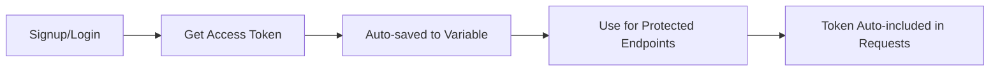

# Postman Collections Overview

## 📚 Available Collections

### 1. **BuildWise Components & Admin API** 
**File:** `BuildWise-Components-Admin-API.postman_collection.json`

Complete testing suite for:
- ✅ Authentication (Signup, Login, Get User)
- ✅ Admin Management (Promote, Demote, List)
- ✅ Components Catalog (Public browsing)
- ✅ Components Management (Admin CRUD)
- ✅ Stock Management & Analytics

**Total Requests:** 20+

---

## 🚀 Quick Import

### Method 1: Direct Import
```bash
1. Open Postman
2. Click "Import" button
3. Select: BuildWise-Components-Admin-API.postman_collection.json
4. Done! ✅
```

### Method 2: URL Import
```bash
1. Copy the JSON file content
2. In Postman: Import → Raw text
3. Paste JSON
4. Click Import
```

---

## 📋 What's Inside Each Collection

### BuildWise Components & Admin API

```
📦 Total: 20+ Requests | 4 Folders

┌─ 🔐 Authentication (3)
│  ├─ Signup
│  ├─ Login ⭐ START HERE
│  └─ Get Current User
│
├─ 👨‍💼 Admin Management (3)
│  ├─ List All Admins
│  ├─ Promote User to Admin
│  └─ Demote Admin to Student
│
└─ 📦 Components (Product Catalog) (14)
   │
   ├─ 🌐 Public - Browse (4) [No Auth]
   │  ├─ Get All Components
   │  ├─ Search Components
   │  ├─ Filter by Price Range
   │  └─ Get Component by ID
   │
   ├─ 🛠️ Admin - Management (4) [Auth Required]
   │  ├─ Create Component
   │  ├─ Create Component - Sensor
   │  ├─ Update Component
   │  └─ Delete Component
   │
   └─ 📊 Admin - Stock Management (5) [Auth Required]
      ├─ Update Stock - Set Quantity
      ├─ Update Stock - Add Quantity
      ├─ Update Stock - Subtract Quantity
      ├─ Get Low Stock Components
      └─ Get Out of Stock Components
```

---

## ⚡ Quick Start Guide

### First Time Setup (2 minutes)

```bash
STEP 1: Import Collection
→ Open Postman → Import → Select JSON file

STEP 2: Set Your Email
→ Click collection → Variables tab
→ Change "adminEmail" to your email

STEP 3: Login
→ Authentication → Login
→ Click Send
→ ✅ Token auto-saved!

STEP 4: Start Testing
→ Try any endpoint!
```

---

## 🎯 Common Workflows

### 1️⃣ Setup Product Catalog (Admin)
```
1. Login (admin account)
2. Create Component → Arduino Uno
3. Create Component → DHT22 Sensor
4. Get All Components (verify)
```

### 2️⃣ Browse as Customer (Public)
```
1. Get All Components (no auth needed!)
2. Search Components → "arduino"
3. Filter by Price Range → ₹500-₹2000
4. Get Component by ID → View details
```

### 3️⃣ Manage Stock (Admin)
```
1. Login (admin account)
2. Update Stock → Add 50 units
3. Get Low Stock Components
4. Update Stock → Restock items
```

### 4️⃣ Admin Management
```
1. Login (admin account)
2. List All Admins
3. Promote User to Admin
4. List All Admins (verify)
```

---

## 🔑 Authentication Flow



**Key Points:**
- ✅ Token auto-saved after login
- ✅ Auto-included in protected requests
- ✅ Valid for 15 minutes
- ✅ Refresh when expired

---

## 📊 Request Statistics

| Category | Public | Admin Only | Total |
|----------|--------|------------|-------|
| **Authentication** | 3 | 0 | 3 |
| **Admin Management** | 0 | 3 | 3 |
| **Component Browse** | 4 | 0 | 4 |
| **Component Management** | 0 | 4 | 4 |
| **Stock Management** | 0 | 5 | 5 |
| **TOTAL** | **7** | **12** | **19** |

---

## ✅ Auto-Tests Included

Every request includes automatic tests:

```javascript
✓ Status code is correct
✓ Response has success field
✓ Data structure is valid
✓ Required fields exist
✓ Variables auto-saved
```

**View Results:**
- Check "Test Results" tab after sending request
- Green ✅ = Passed
- Red ❌ = Failed with details

---

## 🛠️ Variables Used

| Variable | Purpose | Auto-Set? |
|----------|---------|-----------|
| `baseUrl` | API endpoint | ❌ Manual |
| `accessToken` | JWT token | ✅ Auto (login) |
| `refreshToken` | Refresh token | ✅ Auto (login) |
| `componentId` | Last component | ✅ Auto (create) |
| `adminEmail` | Your email | ❌ Manual |

**To View/Edit Variables:**
```
Click collection name → Variables tab
```

---

## 🐛 Troubleshooting Quick Fix

| Error | Solution |
|-------|----------|
| `401 Unauthorized` | Run Login request again |
| `403 Forbidden` | Need admin role: `pnpm run promote-admin email@example.com` |
| `404 Not Found` | Check componentId variable is set |
| `ECONNREFUSED` | Start server: `pnpm dev` |

---

## 📁 File Structure

```
postmanAPI/
├── README.md                                    (This file)
├── QUICK_START.md                               (Quick guide)
├── BuildWise-Components-Admin-API.postman_collection.json
└── auth/
    └── [Auth-related collections]
```

---

## 🔗 Related Documentation

- **Detailed Testing Guide:** `README.md` (in this folder)
- **API Documentation:** `/backend/src/features/components/README.md`
- **Admin Access Guide:** `/backend/ADMIN_ACCESS_GUIDE.md`
- **Complete Feature Docs:** `/COMPONENTS_COMPLETE.md`

---

## 💡 Pro Tips

### 1. Use Collection Runner
Run all requests sequentially:
```
Collection → Run → Select all → Run
```

### 2. Save Example Responses
```
After successful request → Save Response
Helps document expected responses
```

### 3. Create Test Data
```
Use "Create Component - Sensor" multiple times
with different data to populate catalog
```

### 4. Monitor Network
```
Postman Console (bottom) shows all requests
Debug issues easier
```

---

## 🎓 Learning Path

**Beginner:**
1. Import collection
2. Run Login
3. Try public endpoints
4. View responses

**Intermediate:**
5. Create components
6. Update stock
7. Search & filter
8. Test error cases

**Advanced:**
9. Use Collection Runner
10. Create custom tests
11. Set up environments
12. Automate workflows

---

## 📞 Need Help?

1. Check `README.md` in this folder (detailed guide)
2. See API docs: `/backend/src/features/components/README.md`
3. Check server logs: `tail -f backend/logs/server.log`
4. Verify server is running: `http://localhost:4000/health`

---

## 🎉 You're Ready!

**Next Steps:**
1. ✅ Import collection
2. ✅ Update `adminEmail` variable
3. ✅ Run Login request
4. ✅ Start testing!

**Happy Testing! 🚀**

---

*Last Updated: December 9, 2024*
*Collection Version: 1.0.0*
